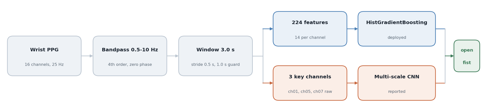
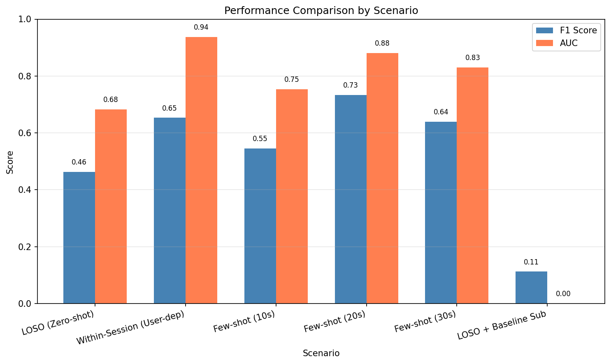
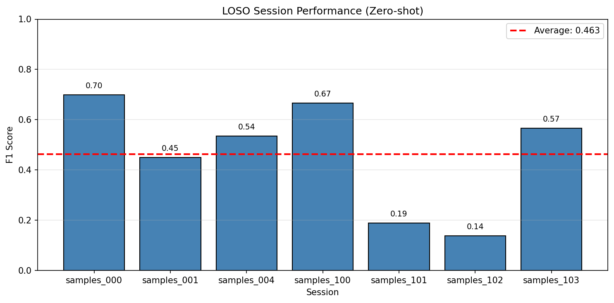
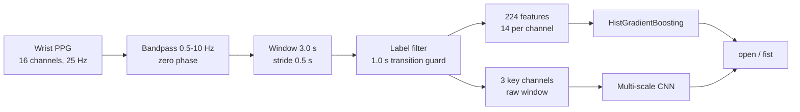

# PPG Fist Classifier

Yuhyeon Lee · 2025

[](LICENSE)
[](https://www.python.org/)
[](#limitations)

[**Results**](#results) · [**Method**](#method) · [**Figures**](docs/figures) · [**Data**](#data)



**PPG Fist Classifier** detects whether a hand is open or clenched from the
photoplethysmography sensor already present in a wrist device. No electrodes, no
camera, nothing added to the strap: clenching squeezes the tissue under the sensor
and changes the perfusion signal, and that change is what the classifier reads.
The repository holds the full chain from raw recordings to a real-time UDP
service, together with the experiment that produced the numbers below.

## Results

Seven recording sessions, three with a normal strap and four with the strap pulled
tight. Every number comes from the multi-scale CNN, averaged over sessions.
Regenerate all of it with `python scripts/report_experiment.py`.

| Scenario | F1 | AUC |
|---|---|---|
| Leave-one-session-out, no calibration | 0.46 | 0.68 |
| Calibrated on the first 10 s of the held-out session | 0.55 | 0.75 |
| Calibrated on the first 20 s | **0.73** | 0.88 |
| Calibrated on the first 30 s | 0.64 | 0.83 |
| Trained and tested within one session | 0.65 | **0.94** |
| Leave-one-session-out with per-session baseline subtraction | 0.11 | 0.00 |



**A generic model does not transfer.** Held out from training, a session scores
0.46 F1. Twenty seconds of labelled data from that same session raises it to 0.73,
which is the single most useful result here: the sensor is usable, but only after
it has seen the wearer.

**The average hides most of the story.** Per-session F1 under leave-one-session-out
runs from 0.14 to 0.70, a five-fold spread around a mean of 0.463. Two sessions
account for almost all of the loss.



**Baseline subtraction fails.** Subtracting each session's own resting baseline was
meant to remove the between-session offset. It removes the signal instead: F1 falls
to 0.11 and AUC to 0.00, which is worse than chance and means the transform inverts
the class ordering. The row stays in the table because it rules the approach out.

**Read the calibration numbers with care.** The calibration window is taken from the
head of the held-out session, so a longer calibration leaves a smaller and later
test set. The drop from 20 s to 30 s is therefore not evidence that more calibration
hurts. The 40 s and 60 s settings in the sweep produced no result at all, because no
session was long enough to leave a usable test split.

**Sessions are not subjects.** Leave-one-session-out establishes that the model
survives a change of session, including a change of strap tension. It does not on
its own establish generalisation to an unseen person.

Confusion matrix, ROC curve, within-session breakdown and the calibration sweep are
in [`docs/figures/`](docs/figures).

## Quick start

```bash
pip install -r requirements.txt
```

Put the recordings in `data/recordings/` (see [Data](#data)), then:

```bash
# CSV recordings -> windowed feature set
python -m ppg_classifier.preprocessor \
    --runs-glob "./data/recordings/samples_*.csv" \
    --out ./data/baseline_all.npz

# train the deployed classifier
python -m ppg_classifier.train --data ./data/baseline_all.npz --model gb --output-dir ./models

# leave-one-session-out evaluation
python -m ppg_classifier.evaluate --data ./data/baseline_all.npz --loso --model-type gb
```

## Method



**Signal chain.** Each channel is bandpass filtered between 0.5 and 10 Hz with a
fourth-order Butterworth applied forward and backward, so no phase shift is
introduced. The stream is then cut into 3.0 s windows at a 0.5 s stride.

**Label cleaning.** A window counts as a fist only if at least 90% of its samples
are labelled fist, and as open only if at most 10% are. Windows within 1.0 s of a
label change are dropped entirely. Without that guard the transition frames sit in
both classes and inflate the score.

**Features.** 14 per channel, 224 in total for the 16-channel device.

| Group | Count | Features |
|---|---|---|
| Time domain | 6 | mean, std, min, max, peak-to-peak, RMS |
| Gradient | 4 | mean, std, RMS, mean absolute |
| Band power | 3 | 0.5-2.5 Hz, 2.5-5 Hz, 5-10 Hz |
| Baseline | 1 | relative DC shift |

**Two model paths.** The deployed classifier is a `HistGradientBoostingClassifier`
over the 224 features, which is what `realtime.py` loads. The reported experiment
instead trains a multi-scale CNN (kernels 3, 5 and 7) on raw windows from the three
channels that separate the classes best on their own: ch01, ch05 and ch07, all with
Cohen's *d* above 0.5.

## Usage

Real-time inference:

```bash
python -m ppg_classifier.realtime --model ./models/final_model_gb.pkl --port 65002
```

The service reads 80-byte UDP packets: a four-float header (hour, minute, second,
nanosecond) followed by 16 `int32` channel values. It holds a rolling 3 s buffer,
predicts at the stride rate, and can fit a per-user model on the fly from a guided
calibration sequence, combining it with the generic model.

Compare model families on one split:

```bash
python -m ppg_classifier.evaluate --data ./data/baseline_all.npz --benchmark
```

Available model types are `gb`, `rf` and `logistic`, with `xgb` and `lgb` if XGBoost
or LightGBM are installed.

## Repository layout

```
ppg_classifier/          library and command-line entry points
  preprocessor.py        filtering, windowing, feature extraction
  model.py               model configuration, factory, save and load
  train.py               fit a model on a feature set
  evaluate.py            train/test split, LOSO, model comparison
  realtime.py            UDP service with per-user calibration
scripts/
  report_experiment.py   reproduces every figure and number in Results
docs/figures/            result figures and the pipeline diagram
data/recordings/         raw session CSVs, downloaded, not in git
models/                  trained models, not in git
```

## Data

The recordings are not in the repository. Download them from
[Google Drive](https://drive.google.com/drive/folders/13Jly9BetyXIt-W287WnxIfIVWaeSLB2m?usp=sharing)
and place them as:

```
data/recordings/samples_*.csv          normal strap
data/recordings/tight/samples_*.csv    tight strap
```

Requires Python 3.12, NumPy, SciPy, scikit-learn, pandas, joblib, PyTorch and
Matplotlib. PyTorch is needed only for the report experiment; the deployed
gradient-boosting path does not use it.

## Limitations

- Twenty seconds of labelled calibration per wearer is required before the
  classifier is useful. Without it, F1 is 0.46.
- Two of the seven sessions score below 0.20 F1 when held out. The cause has not
  been isolated; strap tension alone does not explain it, since two of the four
  tight-strap sessions score above 0.55.
- The calibration length sweep is confounded by test-set size, as noted in Results.
- Cross-subject generalisation is untested.
- Evaluated on one device at 25 Hz. Nothing here has been checked at another
  sampling rate or on another sensor layout.

## Citation

```bibtex
@misc{lee2025ppgfist,
  author = {Yuhyeon Lee},
  title  = {PPG Fist Classifier: hand state detection from wrist photoplethysmography},
  year   = {2025},
  note   = {Unpublished. https://github.com/blueion0612/PPG_Classifier}
}
```

## License

MIT. See [LICENSE](LICENSE).
