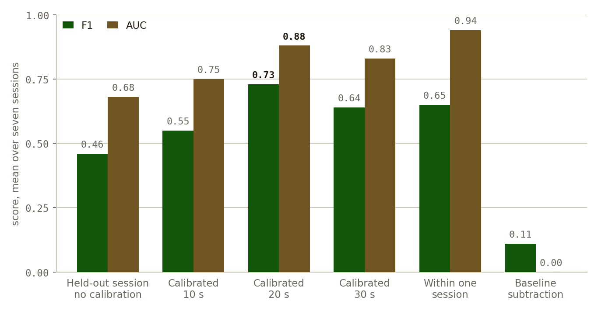
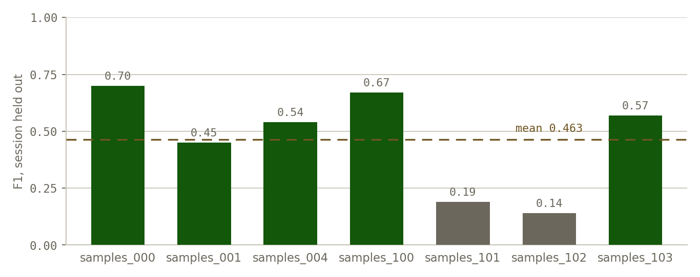
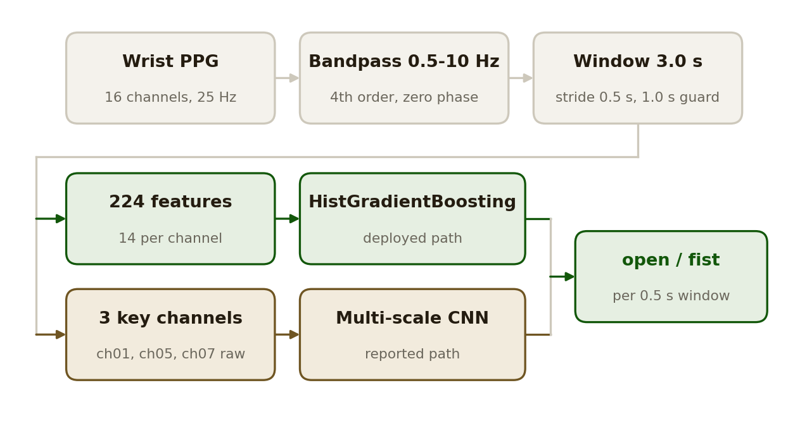

<div align="center">

# PPG Fist Classifier: open hand or clenched fist from a smartwatch's PPG sensor

Yuhyeon Lee · 2025

[](https://github.com/blueion0612/PPG_Fist_Classifier/actions/workflows/tests.yml)
[](LICENSE)
[](https://www.python.org/)
[](#limitations)

[**Recordings**](https://drive.google.com/drive/folders/13Jly9BetyXIt-W287WnxIfIVWaeSLB2m?usp=sharing) · [**Figures**](docs/figures) · [**Related**](#related)

<picture>
  <source media="(prefers-color-scheme: dark)" srcset="docs/figures/hero_scenarios-dark.png">
  
</picture>

</div>

*F1 and AUC for every evaluation scenario, mean over seven sessions. Drawn from
`docs/figures/results.json`, which the experiment script writes and which the test
suite checks the table below against.*

**PPG Fist Classifier** detects whether a hand is open or clenched from the
photoplethysmography sensor already present in a wrist device. No electrodes, no
camera, nothing added to the strap: clenching squeezes the tissue under the sensor
and changes the perfusion signal, and that change is what the classifier reads.
The repository holds the full chain from raw recordings to a real-time UDP
service, together with the experiment that produced every number on this page.

## Results

Seven recording sessions, three with a normal strap and four with the strap pulled
tight. Every number comes from the multi-scale CNN, averaged over sessions.
Regenerate all of it with `python scripts/report_experiment.py`. The script writes
`docs/figures/results.json`, and `tests/test_readme_numbers.py` fails the moment
this table stops matching it.

| Scenario | F1 | AUC |
|---|---:|---:|
| Leave-one-session-out, no calibration | 0.46 | 0.68 |
| Calibrated on the first 10 s of the held-out session | 0.55 | 0.75 |
| Calibrated on the first 20 s | **0.73** | 0.88 |
| Calibrated on the first 30 s | 0.64 | 0.83 |
| Trained and tested within one session | 0.65 | **0.94** |
| Leave-one-session-out with per-session baseline subtraction | 0.11 | 0.00 |

### A generic model does not transfer

Held out from training, a session scores
0.46 F1. Twenty seconds of labeled data from that same session raises it to 0.73,
which is the single most useful result here: the sensor is usable, but only after
it has seen the wearer.

### The average hides most of the story

Per-session F1 under leave-one-session-out
runs from 0.14 to 0.70, a five-fold spread around a mean of 0.463. Two sessions
account for almost all of the loss.

<picture>
  <source media="(prefers-color-scheme: dark)" srcset="docs/figures/sessions_loso-dark.png">
  
</picture>

*Per-session F1 with that session held out. The dashed line is the 0.463 mean the
table reports; the two gray sessions are the ones below 0.20.*

### Baseline subtraction fails

Subtracting each session's own resting baseline was
meant to remove the between-session offset. It removes the signal instead: F1 falls
to 0.11 and AUC to 0.00, which is worse than chance and means the transform inverts
the class ordering. The row stays in the table because it rules the approach out.

### Read the calibration numbers with care

The calibration window is taken from the
head of the held-out session, so a longer calibration leaves a smaller and later
test set. The drop from 20 s to 30 s is therefore not evidence that more calibration
hurts. The 40 s and 60 s settings in the sweep produced no result at all, because no
session was long enough to leave a usable test split.

### Sessions are not subjects

Leave-one-session-out establishes that the model
survives a change of session, including a change of strap tension. It does not on
its own establish generalization to an unseen person.

<details>
<summary><b>Raw figures from the experiment script</b></summary>

These are the figures `scripts/report_experiment.py` draws itself, kept as it made
them. The two figures above are redrawn from the same numbers.

| Figure | Shows |
|---|---|
| [`fig1_loso_session_performance`](docs/figures/fig1_loso_session_performance.png) | Per-session F1 with that session held out |
| [`fig2_loso_roc_curve`](docs/figures/fig2_loso_roc_curve.png) | Pooled ROC across all held-out sessions |
| [`fig3_loso_confusion_matrix`](docs/figures/fig3_loso_confusion_matrix.png) | Pooled confusion matrix, zero-shot |
| [`fig4_within_session_performance`](docs/figures/fig4_within_session_performance.png) | Per-session F1 when trained on the same session |
| [`fig5_calibration_curve`](docs/figures/fig5_calibration_curve.png) | F1 and AUC against calibration length |
| [`fig6_scenario_comparison`](docs/figures/fig6_scenario_comparison.png) | All six scenarios side by side |

Files ending `-dark` are the dark-theme variants.

</details>

## Quick start

```bash
git clone https://github.com/blueion0612/PPG_Fist_Classifier
cd PPG_Fist_Classifier
pip install -e .
```

Put the recordings in `data/recordings/` (see [Data](#data)), then:

```bash
# CSV recordings -> windowed feature set
python -m ppg_fist_classifier.preprocessor \
    --runs-glob "./data/recordings/samples_*.csv" \
    --out ./data/baseline_all.npz

# train the deployed classifier
python -m ppg_fist_classifier.train --data ./data/baseline_all.npz --model gb --output-dir ./models

# leave-one-session-out evaluation
python -m ppg_fist_classifier.evaluate --data ./data/baseline_all.npz --loso --model-type gb
```

Each module is also installed as a command: `ppg-preprocess`, `ppg-train`,
`ppg-evaluate` and `ppg-realtime` take the same arguments.

## Method

<picture>
  <source media="(prefers-color-scheme: dark)" srcset="docs/figures/pipeline-dark.png">
  
</picture>

*The signal chain. Green is the deployed path, gold the path the reported numbers
come from.*

### Signal chain

Each channel is bandpass filtered between 0.5 and 10 Hz with a
fourth-order Butterworth applied forward and backward, so no phase shift is
introduced. The stream is then cut into 3.0 s windows at a 0.5 s stride.

### Label cleaning

A window counts as a fist only if at least 90% of its samples
are labeled fist, and as open only if at most 10% are. Windows within 1.0 s of a
label change are dropped entirely. Without that guard the transition frames sit in
both classes and inflate the score.

### Features

14 per channel, 224 in total for the 16-channel device.

| Group | Count | Features |
|---|---:|---|
| Time domain | 6 | mean, std, min, max, peak-to-peak, RMS |
| Gradient | 4 | mean, std, RMS, mean absolute |
| Band power | 3 | 0.5-2.5 Hz, 2.5-5 Hz, 5-10 Hz |
| Baseline | 1 | relative DC shift |

### Two model paths

The deployed classifier is a `HistGradientBoostingClassifier`
over the 224 features, which is what `realtime.py` loads. The reported experiment
instead trains a multi-scale CNN (kernels 3, 5 and 7) on raw windows from the three
channels that separate the classes best on their own: ch01, ch05 and ch07, all with
Cohen's *d* above 0.5.

## Usage

Real-time inference:

```bash
python -m ppg_fist_classifier.realtime --model ./models/final_model_gb.pkl --port 65002
```

The service reads 80-byte UDP packets: a four-float header (hour, minute, second,
nanosecond) followed by 16 `int32` channel values. It holds a rolling 3 s buffer,
predicts at the stride rate, and can fit a per-user model on the fly from a guided
calibration sequence, combining it with the generic model.

Compare model families on one split:

```bash
python -m ppg_fist_classifier.evaluate --data ./data/baseline_all.npz --benchmark
```

Available model types are `gb`, `rf` and `logistic`, with `xgb` and `lgb` if XGBoost
or LightGBM are installed.

## Repository layout

```
ppg_fist_classifier/          library and command-line entry points
  preprocessor.py        filtering, windowing, feature extraction
  model.py               model configuration, factory, save and load
  train.py               fit a model on a feature set
  evaluate.py            train/test split, LOSO, model comparison
  realtime.py            UDP service with per-user calibration
scripts/
  report_experiment.py   reproduces every figure and number in Results, writes results.json
tests/                   eight tests on synthetic signals, two on the README numbers
docs/figures/
  results.json           every number the README states, written by the experiment
  make_hero.py           draws the three README figures from results.json
  figstyle.py            the palette every repository under this account shares
  fig*.png               raw output of the experiment script, light and dark
data/recordings/         raw session CSVs, downloaded, not in git
models/                  trained models, not in git
pyproject.toml           package definition, dependencies, console scripts
```

## Tests

Ten tests. Eight run the pipeline on synthetic signals, so none of them need the
recordings; two read this README and assert its numbers against
`docs/figures/results.json`.

```bash
python -m pytest -q
python tests/test_pipeline.py     # the eight signal tests, without pytest
```

They check that the bandpass rejects a 0.05 Hz drift and a 12 Hz tone while passing
2 Hz, that filtering both ways leaves the peak of a symmetric pulse exactly where it
was, that band power lands in the band the tone occupies, that a channel yields
exactly 14 named features, that the factory can build every model type it advertises,
and that a saved model package reloads and predicts identically.

## Data

The recordings are not in the repository. Download them from
[Google Drive](https://drive.google.com/drive/folders/13Jly9BetyXIt-W287WnxIfIVWaeSLB2m?usp=sharing)
and place them as:

```
data/recordings/samples_*.csv          normal strap
data/recordings/tight/samples_*.csv    tight strap
```

The library needs NumPy, SciPy, scikit-learn, pandas and joblib, which
`pip install -e .` brings in. The report experiment additionally needs PyTorch and
Matplotlib: `pip install -e ".[report]"`. Redrawing the figures alone needs
Matplotlib: `pip install -e ".[figures]"`.

## Limitations

- Twenty seconds of labeled calibration per wearer is required before the
  classifier is useful. Without it, F1 is 0.46.
- Two of the seven sessions score below 0.20 F1 when held out. The cause has not
  been isolated; strap tension alone does not explain it, since two of the four
  tight-strap sessions score above 0.55.
- The calibration length sweep is confounded by test-set size, as noted in Results.
- Cross-subject generalization is untested.
- Evaluated on one device at 25 Hz. Nothing here has been checked at another
  sampling rate or on another sensor layout.

## Related

Three repositories ask the same question of three wrist signals.

- [IMU_Gesture_Classifier](https://github.com/blueion0612/IMU_Gesture_Classifier):
  fifteen hand gestures from a smartwatch's accelerometer and gyroscope, with a
  two-stage deep model.
- [sEMG_Gesture_Classifier](https://github.com/blueion0612/sEMG_Gesture_Classifier):
  six gestures from surface electromyography, classical models, evaluated up to
  leave-one-subject-out.

## Citation

```bibtex
@misc{lee2025ppgfist,
  author  = {Yuhyeon Lee},
  title   = {PPG Fist Classifier: hand state detection from wrist photoplethysmography},
  year    = {2025},
  version = {1.0.0},
  url     = {https://github.com/blueion0612/PPG_Fist_Classifier},
  note    = {Unpublished}
}
```

## License

MIT. See [LICENSE](LICENSE).
